1，联系方式

张久军

13260051510

2，网站架构

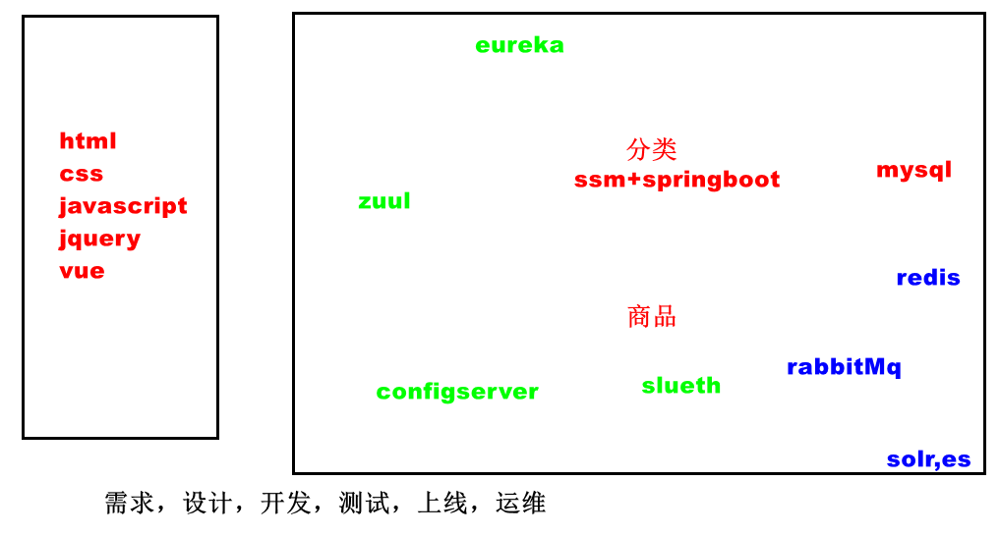

3，面试重点

3.1 java基础：hashmap原理，多线程，jvm调优

3.2 数据库：多表查询，索引，存储过程

3.3 spring ioc,di,aop,springmvc,mybatis,springboot

3.4 dubbo,springcloud 

3.5 redis,rabbitmq,docker

3.6 项目流程

4，课程安排

 day01,用uml设计项目，项目管理(码云)，开发流程，

day02,网络https实现，三次握手，四次挥手，springboot源码

 day03,用java写框架 读spring,springmvc,mybatis的源码

day04 nio,netty,tomcat优化，mysql优化

day05 前端用vue,bootstrap,后端用springcloud

5,软件设计

用starUml工具画软件的图纸

设计注册模块

UserContorller

 String   register(String username,String password)

UserService

​     int register(UserEntity)

UserEntity

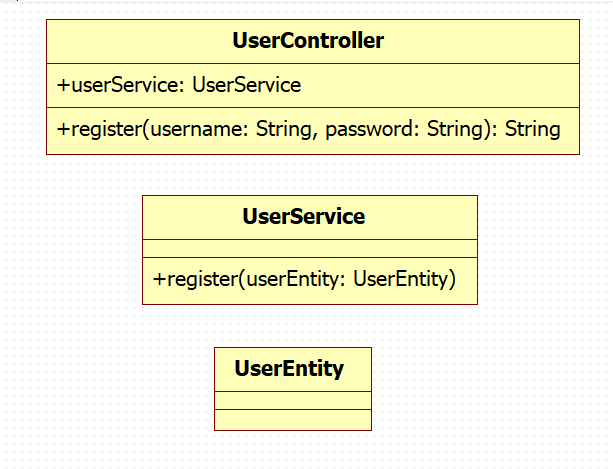

小结：

  编码之前，先做软件设计，设计类图，先评审，找到错误，在设计阶段修改错误，成本低。生成代码之前model-->profiles,把java profile include

6,项目管理平台

6.1 在www.gitee.com上注册用户，回到首页，开通企业免费版

7，上传代码到码云

7. 1 测试git是否安装好

   idea中file-->settings

   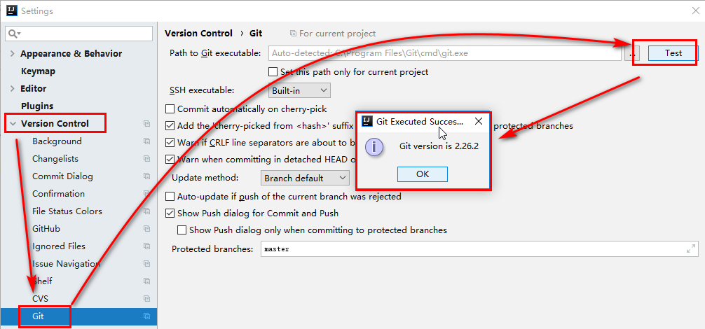

7. 2安装git  

7. 3 在gitee.com上创建仓库

   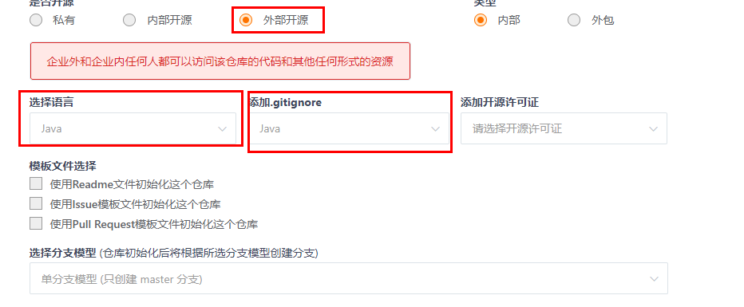

   在仓库中生成.gitIgnore文件，配置了class,jar文件不会上传到服务器上。

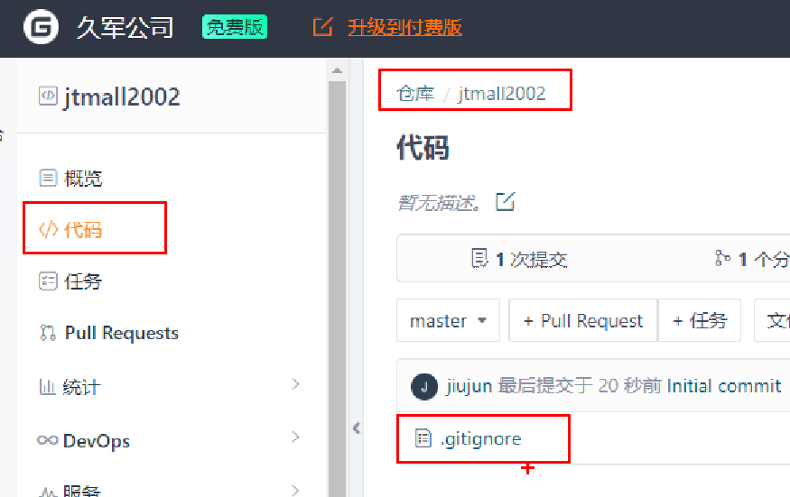

7.4 在idea中开启git

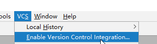

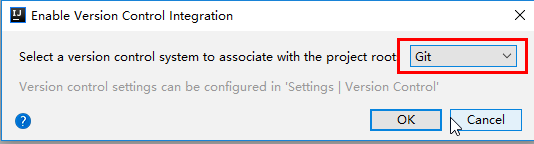

7.5 设置远程服务器地址

从码云服务器上拷贝的地址中有.git  https://gitee.com/jiujun_1/jtmall2002.git

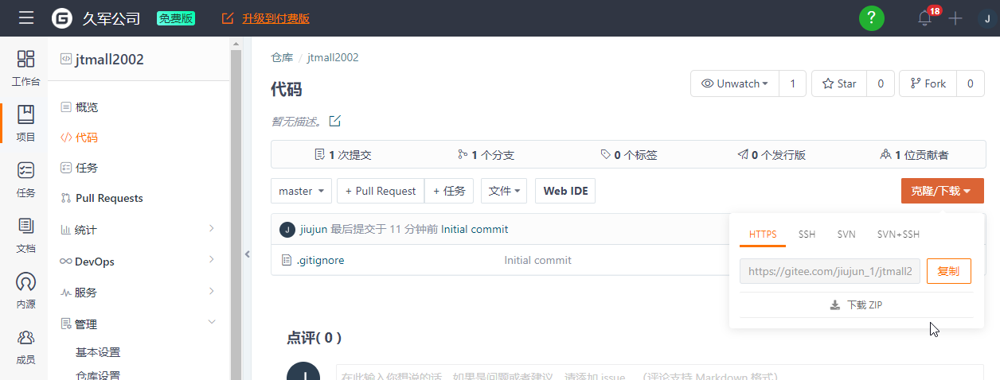

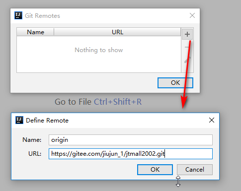

7.6 下载服务器上的.gitignore

 vcs-->git-->pull

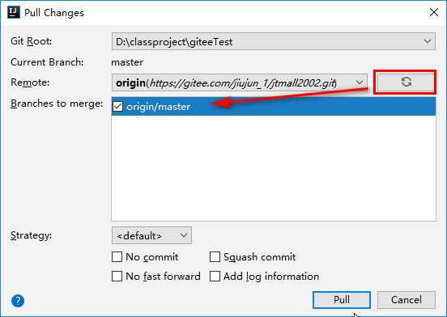

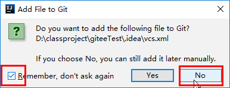

7.7 上传代码

选中模块，不要选 中某个文件，vcs-->git-->add

vcs-->git-->commit directory,不是commit file

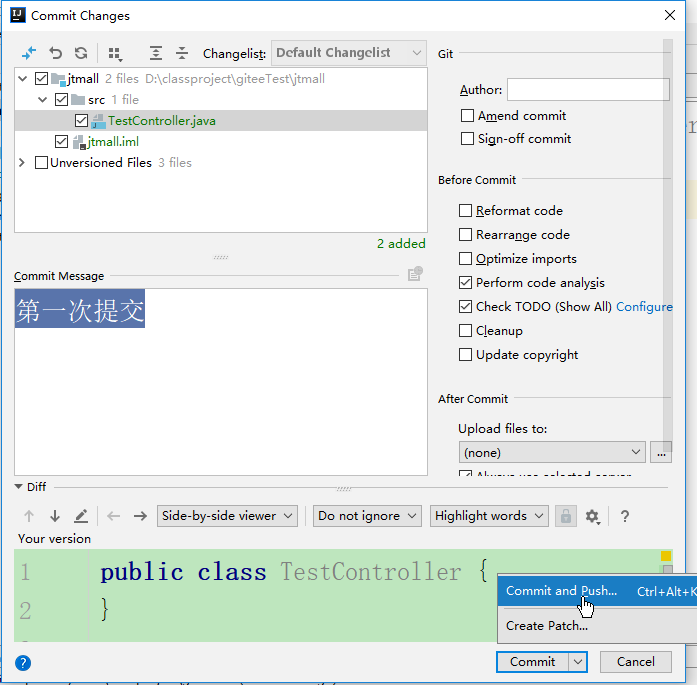

在码云服务器上能看到上传的代码

互联网上用户可以在任何地方访问 https://gitee.com/jiujun_1/jtmall2002

8，小结

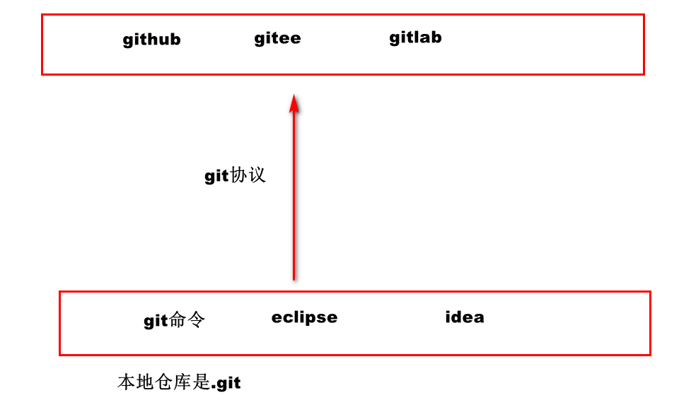

9，在团队中使用git

项目经理上传代码到服务器上，团队中成员从服务器上下载代码，修改代码，增加新的代码，下班的时候，把代码上传到服务器上，项目经理要查看每个成员的代码

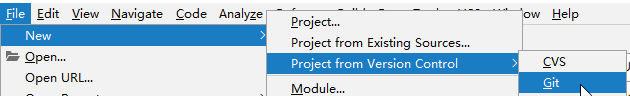

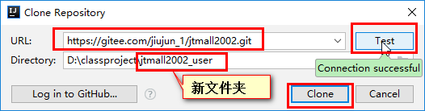

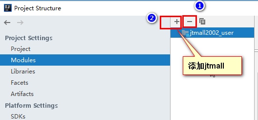

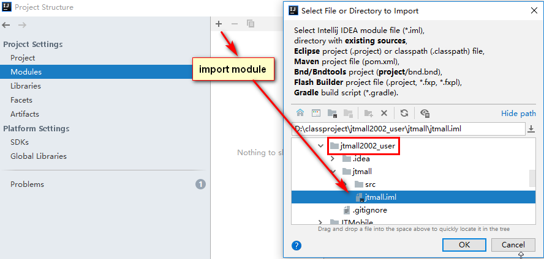

团队中的成员，修改了代码，vcs-->git-->add,   commit and push

项目经理执行vcs-->git-->pull

10,多个人维护一个类，出现代码冲突

​	10.1 项目经理创建一个类GlobalData,上传

​	10.2 成员张三下载了GlobalData,修改，上传

​	10.3项目经理修改GlobalData,上传，出现代码冲突

服务器上是张三提交的最新版本，项目经理在旧的版本上修改代码，并提交，上传失败。

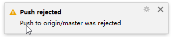

10.4 把服务器上最新代码pull下来，手动解决冲突。

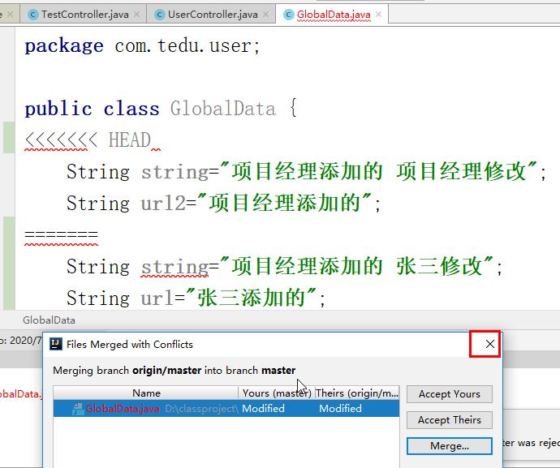

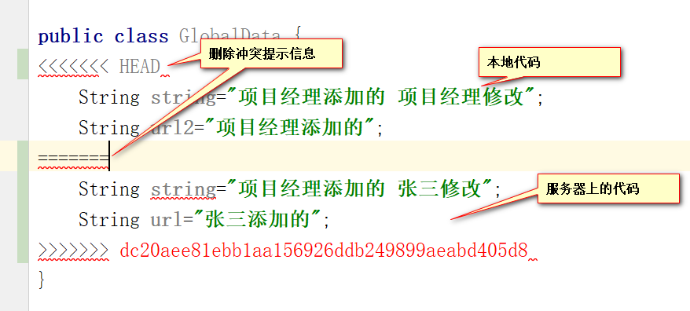

https://gitee.com/jiujun_1/cgbGiteeCode

11，面试题：项目是如何做出来的？

需求，框架设计，详细，编码，测试，上线，运维

12，面试题：团队中有多少人？每个人负责什么？

项目经理1，后端2个人，前端1个人，需求1个人，数据库由项目经理，上线由后端负责。

你负责什么？负责后端

13，开发流程

​	软件企业分信息化企业和互联网公司

信息化企业如用友，做企业管理软件，超市管理软件，酒店管事软件，银行管理软件。

互联网公司，bat.

​	13.1组建团队

​	13.2 需求

​			13.2.1功能性需求

​			需求人员负责与客户沟通。一个程序员有一个需求人员配合你

​			13.2.2非功能性需求

​					13.2.2.1性能

​							执行速度，联网程序，

​					13.2.2.2安全

​							sql注入

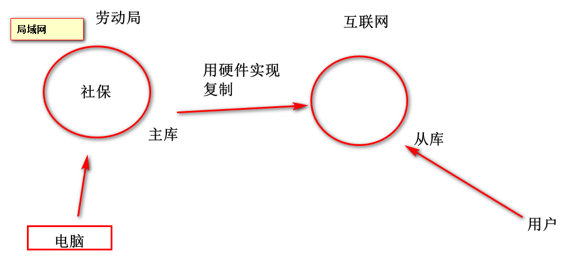

​					13.2.2.3 可用性

​						99.99% 一个月中99.99%的时间内，服务器正常工作。一个月内服务器能停机多少秒？ 259秒

​	 30 * 24 * 60  *60 *0.0001

​					13.2.2.4可靠性

添加一个商品，数据库关机，增加消息队列

​					13.2.2.5 稳定性

​									1,开关：在网关上关闭不重要的服务

​									2限流：购物车没有关闭，handleInterceptor 来一个用户加1,处理完一个用户减1，超过10000，直接返回json

​									3,快速失败：hystrix

13.3 框架设计

​	13.3.1选型

​	   vue/react

​       springmvc,spring,mybatis / struts,spring,hibernate

​		dubbo/springcloud

​		mysql/oracle/sqlserver

​	13.3.2开发框架

​      bat自己开发框架

13.4 详细设计

  针对每个模块设计类图

13.5 编码

​     使用git

13.6 测试

13.7 上线

 灰度发布

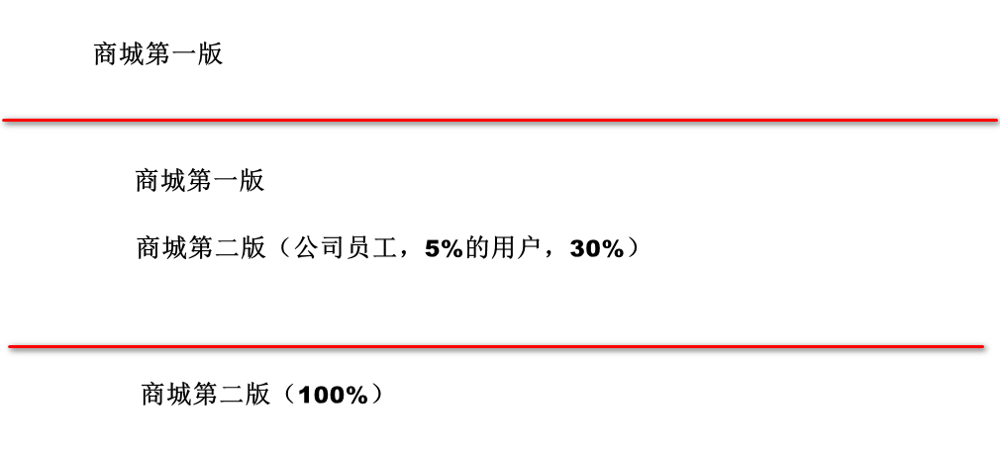

13.8 运维

监控服务器的cpu,内存，带宽，监控有多少个请求，请求执行的平均时间，最长的时间。

监控业务的数据，注册了多少用户，下了多少订单，收入多少钱

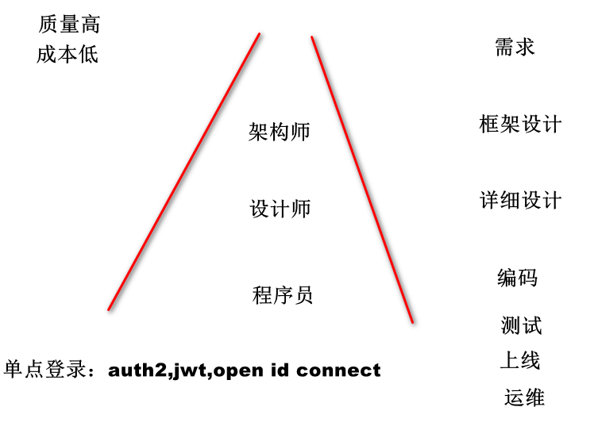

互联网公司流程迭代快，快速低成本做出来，让用户去用。

信息化企业，

小结：组建团队，需求，框架设计，详细设计，编码，测试，上线，运维

14，面试题：项目中写过那些文档。文档主要是给维护的人看的。

有需求文档。

14.2制作界面的原型

安装项目文档.rar中axure,

解压mall-master.zip, 

双击doucment/axure/mall-app.rp,选中mainpage-->preview

https://www.processon.com 打开下面的图

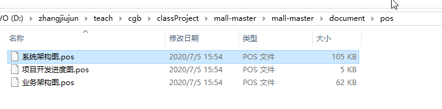

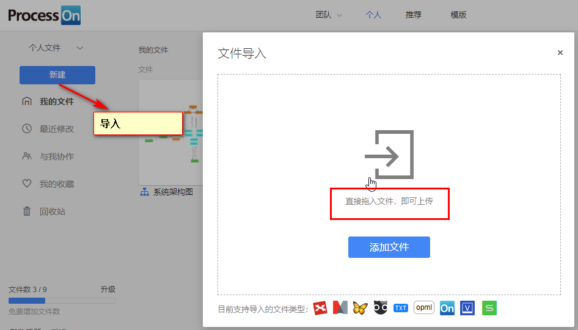

总结

组建团队，

需求：给政府企业做项目有需求文档，做原型。互联网企业做原型

框架设计：有框架设计文档

详细设计：有类图

编码：有开发进度

测试：有测试用例

上线：docker.sh,保存到git服务器

监控：