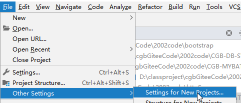
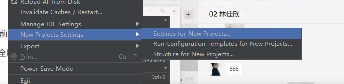
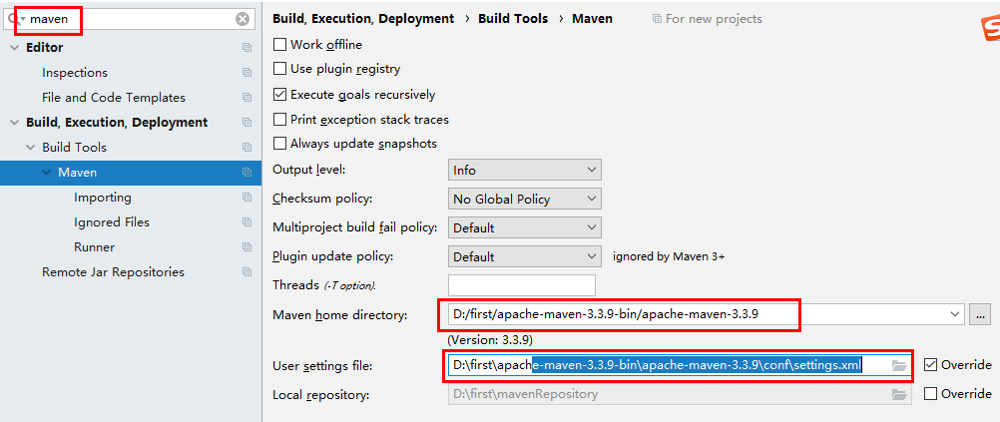
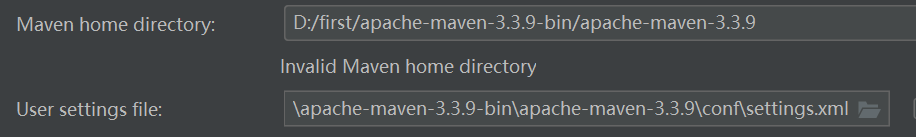
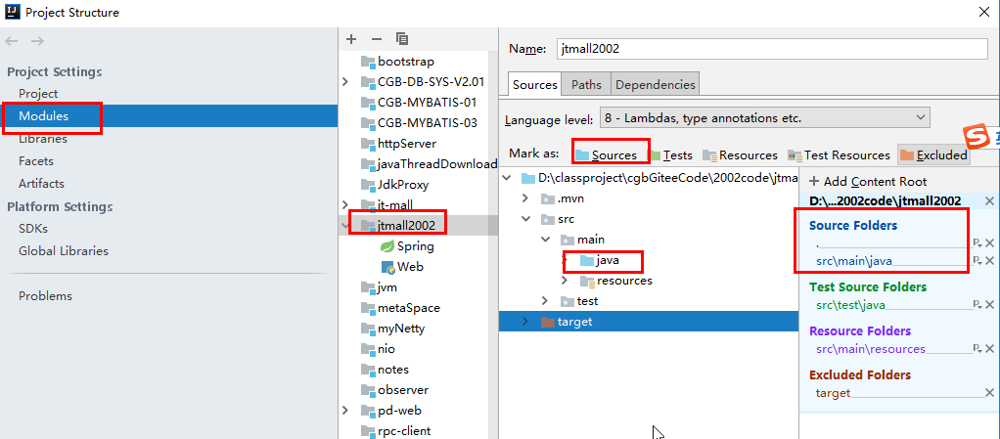

1，复习

开发流程

 组建团队，、

需求（功能性，非功能性需求）

框架设计：单体还是微服务？单体优先，dubbo/springcloud/service mesh

详细设计：确定包，类，方法

编码：

测试：jmeter压力测试

上线：买云服务器

运维：监控服务器信息(cpu,内存，带宽，硬盘)，监控程序信息(有多少个请求，平均时间，最长时间)，监控业务（注册了多少个新用户，订单多少，）

2，面试题：你的网站有多少用户？能承受多少用户访问？

做个压力测试，用jmeter测试出来网站每秒能承受多少用户。

在idea中创建springboot项目 jtmall

idea的社区版不能直接创建springboot项目，需要安装个plugin  spring assistant

3,打开以前的项目

3.1 设置全局的maven

有的idea如下图

设置maven的根目录和配置文件

3.2 解压code.rar, idea-->open

3.3 检查一个maven的设置 file-->settings-->maven

如果显示 invalid Manven Home directory,必须修改maven的根目录和配置文件。

3.4 创建一个spring boot项目，添置spring web依赖，

在pom.xml中修改springboot的version为2.1.5,右边有个maven 窗口，选 中项目 reimport

有的电脑需要设置java为source folder

添加一个controller,启动项目

http://localhost:8080/test

idea企业版网盘

链接：https://pan.baidu.com/s/1FhaPwcywPu2t0t0e_Kvbgw 

提取码：2iv9

3.5 压力测试